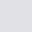

<h1 align="center">

  
   

Omni

</h1>

> A dark theme for [Hyper](https://hyper.is), [Insomnia](https://insomnia.rest),
> [GTK](https://www.gtk.org), [Konsole](https://konsole.kde.org),
> [Mailspring](https://getmailspring.com), [Ulauncher](https://ulauncher.io),
> [VSCode](https://code.visualstudio.com), [Slack](https://slack.com),
> [DuckDuckGo](https://duckduckgo.com), [Figma](https://www.figma.com),
> [Sketch](https://www.sketch.com), [Alacritty](https://github.com/alacritty/alacritty),
> [Firefox](https://www.mozilla.org/firefox), [iTerm 2](http://iterm2.com),
> [Terminal.app](<https://en.wikipedia.org/wiki/Terminal_(macOS)>),
> [MacDown](https://macdown.uranusjr.com), [Sublime Text](http://sublimetext.com),
> [Obsidian](https://obsidian.md/)
> and many more.

## Install

All instructions can be found at [github.com/getomni](https://github.com/getomni).

## Color Palette

| Palette      | Hex       | RGB           | HSL             |    |
| ------------ | --------- | ------------- | --------------- | ----------------------------------------------- |
| Background   | `#191622` | `25 22 34`    | `255° 21% 11%`  |      |
| Current Line | `#41414D` | `65 65 77`    | `240° 8% 28%`   |  |
| Selection    | `#41414D` | `65 65 77`    | `240° 8% 28%`   |        |
| Foreground   | `#E1E1E6` | `225 225 230` | `240° 9% 89%`   |      |
| Comment      | `#5A4B81` | `90 75 129`   | `257° 26% 40%`  |            |
| Cyan         | `#78D1E1` | `120 209 225` | `189° 64% 68%`  |                  |
| Green        | `#67E480` | `103 228 128` | `132° 70% 65%`  |                |
| Orange       | `#E89E64` | `232 158 100` | `26° 74% 65%`   |              |
| Pink         | `#FF79C6` | `255 121 198` | `326° 100% 74%` |                  |
| Purple       | `#988BC7` | `152 139 199` | `253° 35% 66%`  |              |
| Red          | `#E96379` | `233 99 121`  | `350° 75% 65%`  |                    |
| Yellow       | `#E7DE79` | `231 222 121` | `55° 70% 69%`   |              |

## FAQ

## Team

Omni is a project created by [Rocketseat](https://rocketseat.com.br/).

## Organization

See [Omni organization](https://github.com/getomni) for all of our repositories.

## Credits

- Color palette inspired by [@zenorocha's Drakula theme](https://draculatheme.com/)
